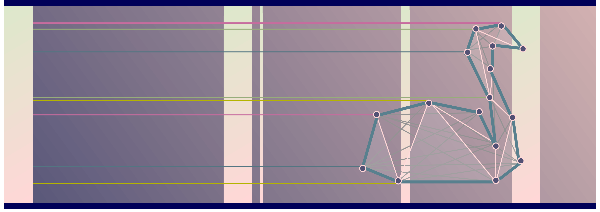

# PBD
*„Constraints are as fundemental in game physics, as shaders are in computer graphics“* - **Erin Catto**

Der Quellcode und Programm zur Facharbeit  ***"Positionsbedingte Dynamiken".***
verfasst von **Benedikt Schöps** _(@m4dh0rs3)_, abgegeben am 28.02.2020 am **Clara-Wieck-Gymnasium Zwickau.**

Basierend auf dem Paper [***"Position Based Dynamics"***](https://matthias-research.github.io/pages/publications/posBasedDyn.pdf) von u.A. **Matthias Müller**

Betreuer: **Lucas Völkel**

Lektoren: **Jonathan Schöps, Daniel Schöps**

## Windows:
1. Lade den kompremierten Ordner _"PBD-Windows"_ herunter
2. Schlüssle ihn auf mit 7-Zip oder RAR.
3. Neben den DLL-Bibliotheken ist die Anwendungsdatei _"PBD"_ vorhanden. Wen du bereits das Framework LÖVE2D instaliert hast, dann kanst du auch die Datei mit dem Suffix _".love"_ ausführen.

## Linux:
1. Instaliere das LÖVE2D Package. Dazu gibt es auf [LÖVE2D.ORG](https://love2d.org) mehr informationen
2. Lade dir die Datei _"PBD.love"_ herunter.
3. Je nach Desktop kannst du das Programm mit einem Doppelklick, alternativ auch mit $ love PBD.love ausführen.

## Android:
Du kannst das PBD-Programm auch auf Android ausführen. Bitte folge [dieser Anleitung].(https://love2d.org/wiki/Getting_Started#Android)
